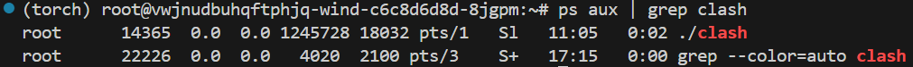

# 一、本地的操作
我们需要先在本地准备好要用到的文件，然后传输到服务器上。

## 1.1 准备文件
一共要准备三个文件，其中两个的下载链接为：

https://github.com/Dreamacro/maxmind-geoip/releases/latest/download/Country.mmdb

https://github.com/Kuingsmile/clash-core/releases/download/1.18/clash-linux-amd64-v1.18.0.gz

还有一个config.yaml文件，这需要先在本地电脑导入你的订阅链接后，找到对应的.yaml文件，再将其重命名为config.yaml即可。

至此，三个文件都已准备好。

## 1.2 传输文件
在服务器端创建两个目录：

```bash
mkdir /opt/clash
mkdir ~/.config/clash
```

将上述.gz文件传输到第一个目录下，再将.mmdb和.yaml文件传输到第二个目录下。

至此，本地的操作结束。

# 二、服务器端的操作
下面需要在服务器端配置代理，所有操作均在Linux终端中进行。

## 2.1 安装软件
在命令行终端中执行：

```bash
cd /opt/clash # 移动到.gz压缩包所在目录
gunzip clash-linux-amd64-v1.18.0.gz # 解压
mv clash-linux-amd64-v1.18.0 clash # 重命名
chmod +x clash # 赋予可执行权限
```

## 2.2 设置全局代理端口（不推荐）
先打开profile文件：

```bash
nano /etc/profile # 打开并编辑profile
```

将光标移动到最后一行（顶格），插入以下文本：

> export http_proxy=127.0.0.1:7890\
> export https_proxy=127.0.0.1:7890

按Ctrl+x→y→Enter保存并退出，再执行：

```bash
source /etc/profile # 更新profile
```

该方法在**所有Shell会话全局生效**，即无论clash是否运行，所有流量均通过7890端口进行转发，这会在不想使用代理时产生麻烦

## 2.3 设置用户级代理端口与快捷方式（推荐）
若想灵活切换代理，可在~/.bashrc中添加以下内容：

> alias proxy="export http_proxy=http://127.0.0.1:7890;export https_proxy=http://127.0.0.1:7890"

> alias unproxy="unset http_proxy;unset https_proxy"

然后运行

```bash
source ~/.bashrc
```

此后可在Shell会话中通过proxy和unproxy命令来开启（需保证clash正在运行）和关闭代理，但每次打开新的Shell会话时都默认不开启代理，需手动开启

查看在当前Shell会话中是否设置了proxy：

```bash
echo $http_proxy # 或 echo $https_proxy
```
若有返回结果，则表明已设置proxy
## 2.4 启动并测试代理
后台运行代理：

```bash
nohup /opt/clash/clash &
proxy # 若没有设置上述快捷方式则忽略
```

测试：

```bash
curl google.com
```

若不报错且有输出结果，则表明配置成功。

## 2.5 关闭clash进程
先查看PID：

```bash
ps aux | grep clash
```

正常情况下会有如下输出：



根据PID杀死进程：

```bash
kill PID # 比如这里的 PID 应替换为 14365
```

## 2.6 图形化操作界面(GUI)
~~待整理~~

移动到.yaml配置文件所在目录：

```bash
cd ~/.config/clash
```

下载图形化操作界面：

```bash
wget https://github.com/haishanh/yacd/releases/download/v0.3.8/yacd.tar.xz
```

或在本地下载好后上传到服务器

解压下载的文件：

```bash
tar -Jxvf yacd.tar.xz
```

重命名：

```bash
mv public dashboard
```

修改.yaml配置文件：

```yaml
port: 7890
socks-port: 7891
allow-lan: true
mode: rule
log-level: info
secret: your_password // 替换为你自己的密码，若不需要密码，注释掉这一行即可
external-ui: dashboard // 增加这一行
external-controller: '0.0.0.0:9090'
```

最后在服务器上开放9090端口，然后访问地址：

> 服务器IP:9090/ui

服务器也可能会再生成一个地址，在该地址后添加/ui即可\
即可打开可视化界面以管理clash


